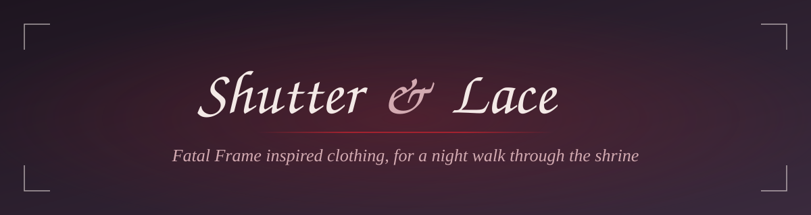
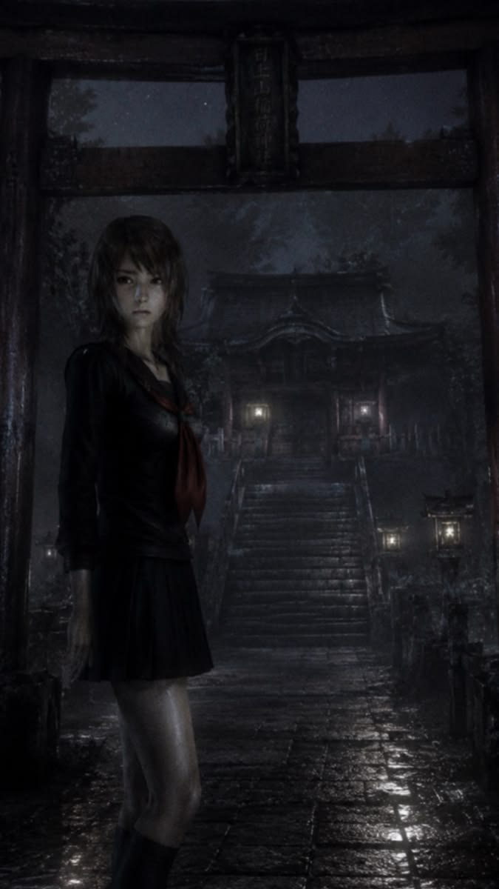
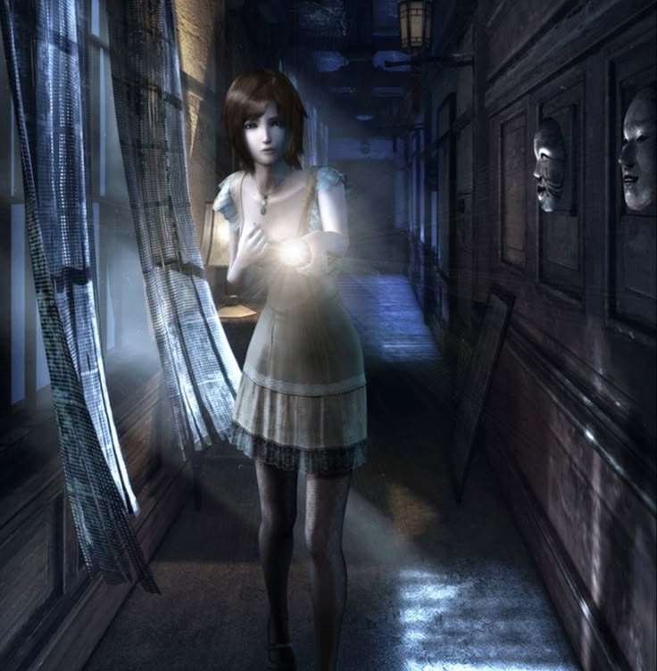
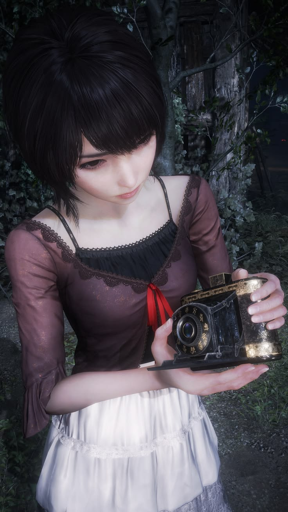
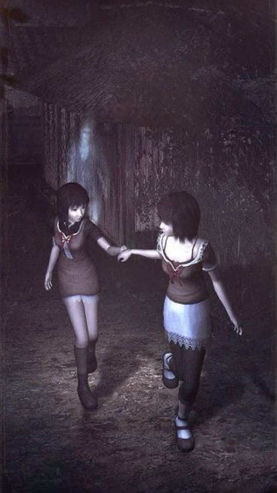
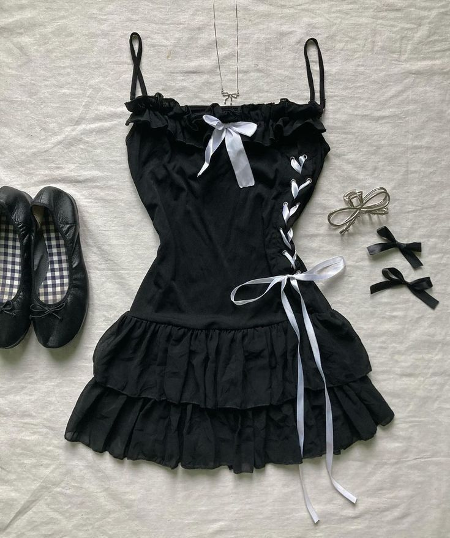
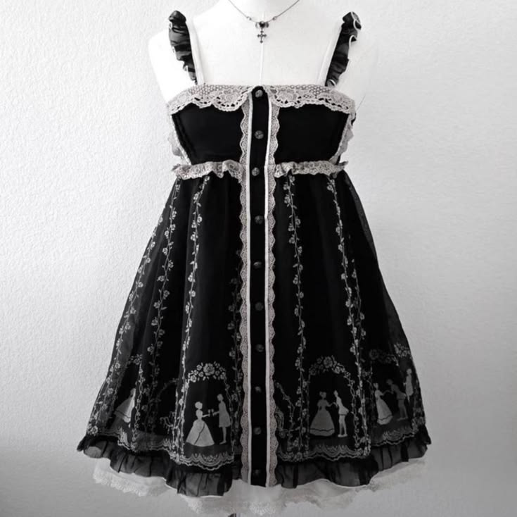
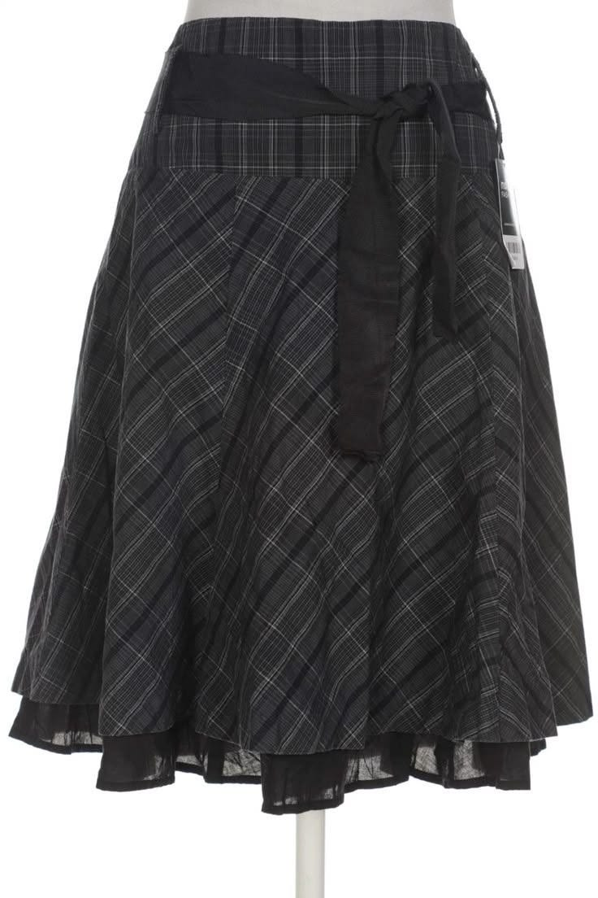

<div align="center">



<br>


*Lace, chiffon and one red ribbon. An online clothing shop in the dusty plum shadows of the Fatal Frame games.*

</div>


<table>
  <tr>
    <td width="25%"></td>
    <td width="25%"></td>
    <td width="25%"></td>
    <td width="25%"></td>
  </tr>
</table>

## About

**Shutter & Lace** is a full-stack e-commerce site for clothing inspired by the Fatal Frame series: sailor uniforms, lace-trimmed dresses, ribbon ties and tiered skirts. The look is soft horror: film grain, camera-viewfinder corners, plum and ivory tones with a single ribbon-red accent.

Customers can sign up, build a profile, browse dresses, open a product page, fill a bag and check out.


## Collections

<table>
  <tr>
    <td width="33%" align="center"><br><b>Ribbon Dresses</b><br><i>Black chiffon, lace-up sides, satin bows</i></td>
    <td width="33%" align="center"><br><b>Lace Dresses</b><br><i>Puff sleeves, floral lace, tie-front bodice</i></td>
    <td width="33%" align="center"><br><b>Tiered Skirts</b><br><i>Plaid ruffles trimmed in black lace</i></td>
  </tr>
</table>


## Features

- **Accounts:** sign up, log in and log out, with bcrypt-hashed passwords and a secure httpOnly session cookie
- **Profiles:** photo, full name, username, phone, email and address, completed right after sign-up and editable later
- **Dashboard:** profile card and order history
- **Shop:** 16 dresses with size pickers, *Add to bag* and *Buy now*
- **Product pages:** large photo, size and quantity selection, and related dresses
- **Bag:** slide-out drawer with quantity controls and a free-shipping hint
- **Checkout:** delivery details pre-filled from the profile, order summary and cash on delivery
- **Safe pricing:** prices and totals are recalculated on the server, never trusted from the browser
- **Two databases:** SQLite for zero-setup local work, PostgreSQL (Neon) in production, switched by one environment variable
- **Responsive:** built to work on phones as well as desktops


## Tech stack

| Layer | Choice |
|---|---|
| Front end | Plain HTML, CSS and JavaScript, no framework |
| Back end | Node.js and Express |
| Auth | bcryptjs and JSON Web Tokens in an httpOnly cookie |
| Local database | SQLite (built into Node 22.13+) |
| Production database | PostgreSQL on [Neon](https://neon.tech) |
| Hosting | [Vercel](https://vercel.com) (static files plus a serverless function) |


## Getting started

You need **Node.js 22.13 or newer**. No database install is required locally.

```bash
git clone https://github.com/YOUR-USERNAME/fatal-frame-cloth-store.git
cd fatal-frame-cloth-store
npm install
npm run dev
```

The terminal prints two links:

```
  Computer:  http://localhost:3000
  Phone:     http://192.168.1.23:3000
```

Open the first on your computer. To preview on your phone, join the same Wi-Fi and open the second. A SQLite database is created automatically at `data/shop.db`. Delete that file to reset all accounts and orders.


## Environment variables

Local development needs none. Set these in production:

| Variable | Purpose |
|---|---|
| `DB_CLIENT` | `sqlite` (default) or `postgres` |
| `DATABASE_URL` | Neon pooled connection string (when using Postgres) |
| `JWT_SECRET` | Long random string used to sign login cookies |
| `PORT` | Local port, default `3000` |

Generate a secret with:

```bash
node -e "console.log(require('crypto').randomBytes(32).toString('hex'))"
```


## Deploying to Vercel with Neon

1. **Create a Neon project.** In **Connect**, turn on connection pooling and copy the connection string.
2. **Create the tables.** Open Neon's **SQL Editor**, paste all of [`schema.sql`](schema.sql) and click **Run**.
3. **Push this repository to GitHub.**
4. **Import it in Vercel.** Keep the root directory, set the framework preset to **Other**, and leave the build command empty.
5. **Add environment variables:** `DB_CLIENT=postgres`, `DATABASE_URL` and `JWT_SECRET`.
6. **Deploy**, then sign up on the live site to confirm everything is connected.

Vercel serves everything in `public/` as static files and runs the Express app through `api/index.js`, using the rewrite in `vercel.json`.

> **Linux is case-sensitive.** Keep file names lowercase (`server.js`, not `Server.js`) or the deployed function will not find them.


## Project structure

```
.
├── api/
│   └── index.js          Vercel entry point
├── public/               Everything the browser loads
│   ├── images/           Wallpapers and products/dress-1.jpg … dress-16.jpg
│   ├── index.html        Homepage
│   ├── login.html
│   ├── signup.html
│   ├── profile-setup.html
│   ├── dashboard.html
│   ├── shop.html
│   ├── product.html
│   ├── checkout.html
│   ├── cart.js           Bag storage helpers
│   ├── bag.js            Slide-out bag drawer
│   └── style.css
├── db.js                 SQLite / PostgreSQL switch
├── products.js           Dress catalogue
├── server.js             Express routes
├── schema.sql            PostgreSQL tables
├── schema.sqlite.sql     SQLite tables (applied automatically)
├── vercel.json
└── package.json
```


## API

| Method | Route | Description |
|---|---|---|
| `POST` | `/api/signup` | Create an account |
| `POST` | `/api/login` | Log in |
| `POST` | `/api/logout` | Log out |
| `GET` | `/api/me` | Current session |
| `GET` `PUT` | `/api/profile` | Read or save the profile |
| `GET` | `/api/products` | Dress catalogue |
| `POST` | `/api/orders` | Place an order |
| `GET` | `/api/orders` | Your order history |
| `GET` | `/api/health` | Database connection check (remove once live) |


## Customising

**Products.** Names, descriptions and prices live in [`products.js`](products.js). Prices are in cents, so `5800` is $58. To add a dress, copy a `P(...)` line and give it the next number.

**Photos.** Add a 3:4 portrait JPG for each dress to `public/images/products/`, named `dress-<number>.jpg`. Dresses without a photo show a "Photo coming soon" frame.

**Colours.** Edit the variables at the top of `public/style.css`:

| Name | Hex |
|---|---|
| Ink | `#1e1520` |
| Plum | `#33243a` |
| Mauve | `#7a5566` |
| Rose | `#d3aab1` |
| Lace | `#f3e9e6` |
| Ribbon | `#a3222f` |


## Roadmap

- [ ] Online card payments
- [ ] Admin panel for products and orders
- [ ] Search, filters and wishlist
- [ ] Order status emails
- [ ] Photo storage outside the database


## Disclaimer

Shutter & Lace is a fan-inspired project. It is not affiliated with, endorsed by or connected to Koei Tecmo or the Fatal Frame / Project Zero series. All game imagery and related trademarks belong to their respective owners. Replace the game artwork with your own photography before launching a real store.

<div align="center">

*Made for those who walk into the dark with a camera.*

</div>
